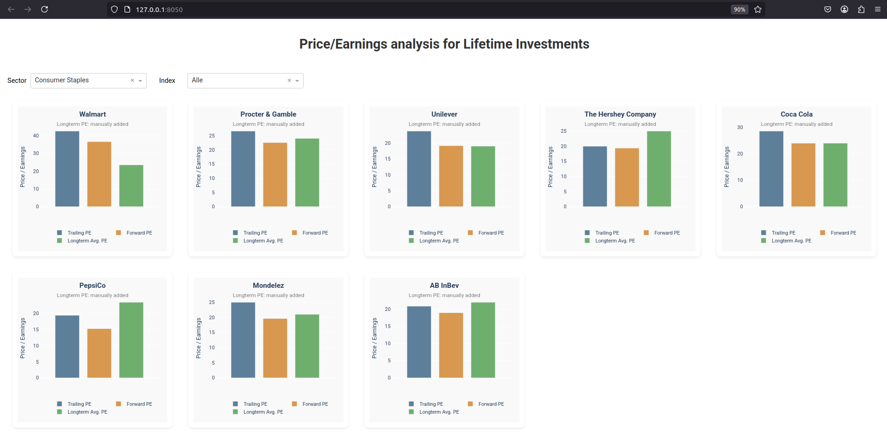

# 📊 Price/Earnings analysis for your Watchlist of longterm Investments

This tool provides a clean and insightful web interface to visualize Price/Earnings ratios (P/E) of selected companies, helping to identify potentially undervalued stocks.

**Keep in mind:** P/E ratios aren’t the full story - but they’re a great way to get a quick sense of how your favorite companies (e.g. some Consumer Staples) are currently valued. It’s not about drawing conclusions at a glance, but spotting where things look interesting enough to dig deeper.



The dashboard displays:

- **Trailing P/E**: Price divided by the most recent 12-month earnings.
- **Forward P/E**: Price divided by projected 12-month earnings ('forwardPE' from yfinance).
- **Long-Term Average P/E**: Historical valuation benchmark (manually defined, or estimated by the tool (data not available on yahoo finance) ).

Use filters for **index** and **sector**. 

**Data is fetched from Yahoo Finance (via yfinance)**

### Create virtual environment

```bash
python -m venv .venv
source .venv/bin/activate # on Windows: .venv\Scripts\activate
```

### Install dependencies
```bash
pip install -r requirements.txt
```

### Add or modify your Watchlist (stocks.yaml)

```yaml 
stocks: 
  - symbol: PG
    name: Procter & Gamble
    long_term_avg_pe: 24.0 # search for long term PE Ratio in the web or let the tool estimate
    sector: Consumer Staples
    index: S&P 500
```

### Run the Dashboard
```bash
python app.py
```
